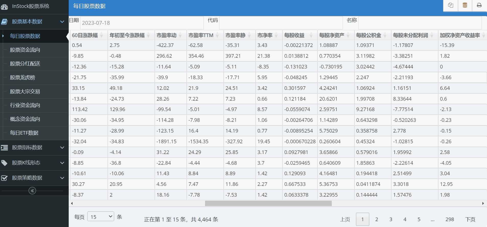
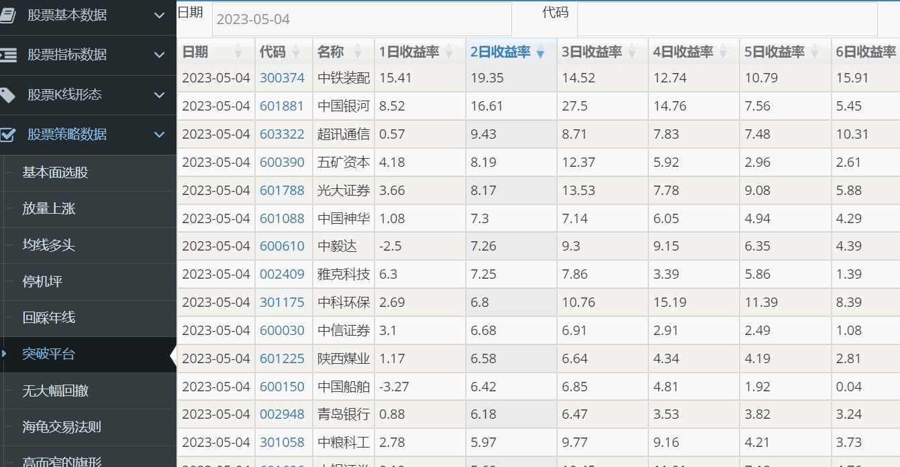

<font size=6>**InStock股票系统**</font>

InStock股票系统，抓取股票每日关键数据，计算股票各种指标，内置多种选股策略，支持选股验证回测，支持批量时间，运行高效，是量化投资的好帮手。

# 功能介绍

##  一：股票每日数据
抓取A股票每日数据，主要为一些关键数据，同时封装抓取方法，方便扩展系统获取个人关注的数据。基于免费开源的akshare抓取，更多数据获取参见 [akshare官网文档](https://www.akshare.xyz/data/stock/stock.html){:target="_blank"}。



## 二：计算股票指标
计算如下指标：
```
1、交易量delta指标分析

The Volume Delta (Vol ∆) 与前一天交易量的增量。

2、计算n天价差

可以计算，向前n天，和向后n天的价差。

3、n天涨跌百分百计算

可以看到，-n天数据和今天数据的百分比。

4、CR指标

[价格动量指标(CR)](http://wiki.mbalib.com/wiki/CR指标) 跌穿a、b、c、d四条线，再由低点向上爬升160时，为短线获利的一个良机，应适当卖出股票。 CR跌至40以下时，是建仓良机。而CR高于300~400时，应注意适当减仓。

5、最大值，最小值

计算区间最大值 volume max of three days ago, yesterday and two days later stock["volume_-3,2,-1_max"] volume min between 3 days ago and tomorrow stock["volume_-3~1_min"] 实际使用的时候使用 -2~2 可计算出5天的最大，最小值。

6、KDJ指标

[随机指标(KDJ)](http://wiki.mbalib.com/wiki/随机指标) 一般是根据统计学的原理，通过一个特定的周期（常为9日、9周等）内出现过的最高价、 最低价及最后一个计算周期的收盘价及这三者之间的比例关系，来计算最后一个计算周期的未成熟随机值RSV， 然后根据平滑移动平均线的方法来计算K值、D值与J值，并绘成曲线图来研判股票走势。 （3）在使用中，常有J线的指标，即3乘以K值减2乘以D值（3K－2D＝J），其目的是求出K值与D值的最大乖离程度， 以领先KD值找出底部和头部。J大于100时为超买，小于10时为超卖。

7、SMA指标

[简单移动平均线（Simple Moving Average，SMA）](http://wiki.mbalib.com/wiki/Sma) 可以动态输入参数，获得几天的移动平均。

8、MACD指标

[平滑异同移动平均线(Moving Average Convergence Divergence，简称MACD指标)](http://wiki.mbalib.com/wiki/MACD) ，也称移动平均聚散指标 MACD 则可发挥其应有的功能，但当市场呈牛皮盘整格局，股价不上不下时，MACD买卖讯号较不明显。 当用MACD作分析时，亦可运用其他的技术分析指标如短期 K，D图形作为辅助工具，而且也可对买卖讯号作双重的确认。

9、BOLL指标

[布林线指标(Bollinger Bands)](http://wiki.mbalib.com/wiki/BOLL) bolling, including upper band and lower band stock["boll"] stock["boll_ub"] stock["boll_lb"] 1、当布林线开口向上后，只要股价K线始终运行在布林线的中轨上方的时候，说明股价一直处在一个中长期上升轨道之中，这是BOLL指标发出的持股待涨信号，如果TRIX指标也是发出持股信号时，这种信号更加准确。此时，投资者应坚决持股待涨。 2、当布林线开口向下后，只要股价K线始终运行在布林线的中轨下方的时候，说明股价一直处在一个中长期下降轨道之中，这是BOLL指标发出的持币观望信号，如果TRIX指标也是发出持币信号时，这种信号更加准确。此时，投资者应坚决持币观望。

10、RSI指标

[相对强弱指标（Relative Strength Index，简称RSI）](http://wiki.mbalib.com/wiki/RSI) ，也称相对强弱指数、相对力度指数 2）强弱指标保持高于50表示为强势市场，反之低于50表示为弱势市场。 （3）强弱指标多在70与30之间波动。当六日指标上升到达80时，表示股市已有超买现象，如果一旦继续上升，超过90以上时，则表示已到严重超买的警戒区，股价已形成头部，极可能在短期内反转回转。

11、W%R指标

[威廉指数（Williams%Rate）](http://wiki.mbalib.com/wiki/威廉指标) 该指数是利用摆动点来度量市场的超买超卖现象。 10 days WR stock["wr_10"] 6 days WR stock["wr_6"]

12、CCI指标

[顺势指标(CCI)](http://wiki.mbalib.com/wiki/顺势指标) ，其英文全称为“Commodity Channel Index”， 是由美国股市分析家唐纳德·蓝伯特（Donald Lambert）所创造的，是一种重点研判股价偏离度的股市分析工具。 1、当CCI指标从下向上突破﹢100线而进入非常态区间时，表明股价脱离常态而进入异常波动阶段， 中短线应及时买入，如果有比较大的成交量配合，买入信号则更为可靠。 2、当CCI指标从上向下突破﹣100线而进入另一个非常态区间时，表明股价的盘整阶段已经结束， 将进入一个比较长的寻底过程，投资者应以持币观望为主。 CCI, default to 14 days

13、TR、ATR指标

[均幅指标（Average True Ranger,ATR）](http://wiki.mbalib.com/wiki/均幅指标) 是取一定时间周期内的股价波动幅度的移动平均值，主要用于研判买卖时机。TR (true range) stock["tr"] ATR (Average True Range) stock["atr"] 均幅指标无论是从下向上穿越移动平均线，还是从上向下穿越移动平均线时，都是一种研判信号。

14、DMA指标

[DMA指标（Different of Moving Average）又叫平行线差指标](http://wiki.mbalib.com/wiki/DMA) ，是目前股市分析技术指标中的一种中短期指标，它常用于大盘指数和个股的研判。 DMA, difference of 10 and 50 moving average stock[‘dma’]

15、DMI，+DI，-DI，DX，ADX，ADXR指标

[动向指数Directional Movement Index,DMI）](http://wiki.mbalib.com/wiki/DMI) [平均趋向指标（Average Directional Indicator，简称ADX）](http://wiki.mbalib.com/wiki/ADX) [平均方向指数评估（ADXR）](http://wiki.mbalib.com/wiki/平均方向指数评估) 实际是今日ADX与前面某一日的ADX的平均值。ADXR在高位与ADX同步下滑，可以增加对ADX已经调头的尽早确认。 ADXR是ADX的附属产品，只能发出一种辅助和肯定的讯号，并非入市的指标，而只需同时配合动向指标(DMI)的趋势才可作出买卖策略。 在应用时，应以ADX为主，ADXR为辅。

16、TRIX，MATRIX指标

[TRIX指标又叫三重指数平滑移动平均指标（Triple Exponentially Smoothed Average）](http://wiki.mbalib.com/wiki/TRIX)

17、VR，MAVR指标

[成交量比率（Volumn Ratio，VR）（简称VR）](http://wiki.mbalib.com/wiki/成交量比率) ，是一项通过分析股价上升日成交额（或成交量，下同）与股价下降日成交额比值， 从而掌握市场买卖气势的中期技术指标。 VR, default to 26 days stock["vr"] MAVR is the simple moving average of VR stock["vr_6_sma"]
```


## 三：判断买入卖出的股票

根据指标判定可能买入卖出的股票，具体筛选条件如下：


```
KDJ:
1、超买区：K值在80以上，D值在70以上，J值大于90时为超买。一般情况下，股价有可能下跌。投资者应谨慎行事，局外人不应再追涨，局内人应适时卖出。
2、超卖区：K值在20以下，D值在30以下为超卖区。一般情况下，股价有可能上涨，反弹的可能性增大。局内人不应轻易抛出股票，局外人可寻机入场。
RSI:
1、当六日指标上升到达80时，表示股市已有超买现象，如果一旦继续上升，超过90以上时，则表示已到严重超买的警戒区，股价已形成头部，极可能在短期内反转回转。
2、当六日强弱指标下降至20时，表示股市有超卖现象，如果一旦继续下降至10以下时则表示已到严重超卖区域，股价极可能有止跌回升的机会。
CCI:
1、当CCI＞﹢100时，表明股价已经进入非常态区间——超买区间，股价的异动现象应多加关注。
2、当CCI＜﹣100时，表明股价已经进入另一个非常态区间——超卖区间，投资者可以逢低吸纳股票。
CR:
1、跌穿a、b、c、d四条线，再由低点向上爬升160时，为短线获利的一个良机，应适当卖出股票。
2、CR跌至40以下时，是建仓良机。
WR:
1、当％R线达到20时，市场处于超买状况，走势可能即将见顶。
2、当％R线达到80时，市场处于超卖状况，股价走势随时可能见底。
VR:
1、获利区域160－450根据情况获利了结。
2、低价区域40－70可以买进。
```


## 四：策略选股

内置放量上涨、停机坪、回踩年线、突破平台、放量跌停等多种选股策略，同时封装了策略模板，方便扩展实现自己的策略。


```
1、放量上涨
2、均线多头
3、停机坪
4、回踩年线
5、突破平台
6、无大幅回撤
7、海龟交易法则
8、高而窄的旗形
9、放量跌停
10、低ATR成长策略
```



## 五：选股验证


对指标、策略等选出的股票进行回测，验证其可用性。


## 六：支持批量


可以通过时间段、枚举时间、当前时间进行指标计算、策略选股及回测等。同时支持智能识别交易日，可以输入任意日期。

具体执行设置如下：
```
------整体作业，支持批量作业------
当前时间作业 python execute_daily_job.py
单个时间作业 python execute_daily_job.py 2022-03-01
枚举时间作业 python execute_daily_job.py 2022-01-01,2021-02-08,2022-03-12
区间时间作业 python execute_daily_job.py 2022-01-01 2022-03-01

------单功能作业，支持批量作业，回测数据自动填补到当前
基础数据作业 python basic_data_daily_job.py
指标数据作业 python indicators_data_daily_job.py
策略数据作业 python strategy_data_daily_job.py
回测数据 python backtest_data_daily_job.py
```

## 七：采用数据库设计

数据存储采用数据库设计，能保存历史数据，以及对数据进行扩展分析、统计、挖掘。系统实现自动创建数据库、数据表，封装了批量更新、插入数据，方便业务扩展。


# 八：可视化展示

采用web设计，可视化展示结果。对展示进行封装，添加新的业务表单，只需要配置视图字典就可自动出现业务可视化界面，方便业务功能扩展。

## 九：运行高效


采用多线程、单例共享资源有效提高运算效率。计算一天的数据运行时间大概3分钟，计算天数越多效率越高。


## 十：方便调试

系统运行的重要日志记录在stock_execute_job.log(数据抓取、处理、分析)、stock_web.log(web服务)，方便调试发现问题。


# 安装说明

建议windows下安装，方便操作及使用系统，同时安装也非常简单。以下安装及运行以windows为例进行介绍。

1.安装最新的 python 3.11.2

```
（1）在官网 https://www.python.org/downloads/ 下载安装包，一键安装即可，安装切记勾选自动设置环境变量。
（2）配置永久全局国内镜像库（因为有墙，无法正常安装库文件），执行如下dos命令：
python pip config --global set  global.index-url https://mirrors.aliyun.com/pypi/simple/
# 如果你只想为当前用户设置，你也可以去掉下面的"--global"选项
```
2.安装最新的mysql数据库。
```
在官网 https://dev.mysql.com/downloads/mysql/ 下载安装包，一键安装即可。
```
3.安装requirements.txt中的库，都是目前最新版本。
```
dos切换到本系统的根目录，执行下面命令：
python pip install -r requirements.txt

也可以通过下面命令生成自己的requirements.txt
python pip freeze > requirements.txt
```

4.安装talib，安装见以下：

```
第一种方法. pip 下安装
（1）https://www.ta-lib.org/下载并解压ta-lib-0.4.0-msvc.zip
（2）解压并将ta_lib放在C盘根目录
（3）https://visualstudio.microsoft.com/zh-hans/downloads/下载并安装Visual Studio Community，安装切记勾选Visual C++功能
（4）Build TA-Lib Library # 构建 TA-Lib 库
    ①在开始菜单中搜索并打开[Native Tools Command Prompt](根据操作系统选择32位或64位)
    ②输入 cd C:\ta-lib\c\make\cdr\win32\msvc
    ③构建库，输入 nmake
（5）安装完成。
第二种方法. Anaconda 下安装
（1）打开Anaconda Prompt终端。
（2）在终端输入命令行conda install -c conda-forge ta-lib 。
（3）此处确认是否继续安装？输入y 继续安装，直到完成
（4）安装完成。
```
5.安装Navicat（可选）

Navicat可以方便管理数据库，以及可以手工对数据进行查看、处理、分析、挖掘。

Navicat是一套可创建多个连接的数据库管理工具，用以方便管理 MySQL、Oracle、PostgreSQL、SQLite、SQL Server、MariaDB 和 MongoDB 等不同类型的数据库

```
（1）在官网 https://www.navicat.com.cn/download/navicat-premium 下载安装包，一键安装即可。

（2）然后下载破解补丁: https://pan.baidu.com/s/18XpTHrm9OiLEl3u6z_uxnw 提取码: 8888 ，破解即可。
```
6.配置数据库

一般可能会修改的信息是”数据库访问密码“。

修改database.py相关信息:

```
db_host = "localhost"  # 数据库服务主机
db_user = "root"  # 数据库访问用户
db_password = "root"  # 数据库访问密码
db_port = 3306  # 数据库服务端口
db_charset = "utf8mb4"  # 数据库字符集
```

# 运行说明

1.执行数据抓取、处理、分析

支持批量作业，具体参见_run_job.bat中的注释说明。

建议将其加入到任务计划中，工作日的每天17：00执行。

```

运行 _run_job.bat
```
2.启动web服务

```
运行 _run_web.bat
```

# 特别声明
本系统参考了pythonstock、sngyai。

股市有风险投资需谨慎，本系统只能用于学习、股票分析，投资盈亏概不负责。
